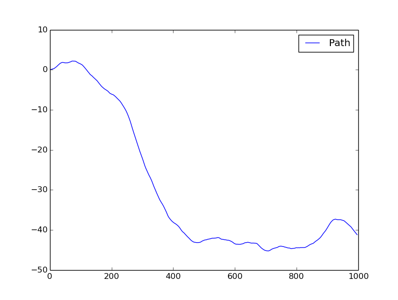
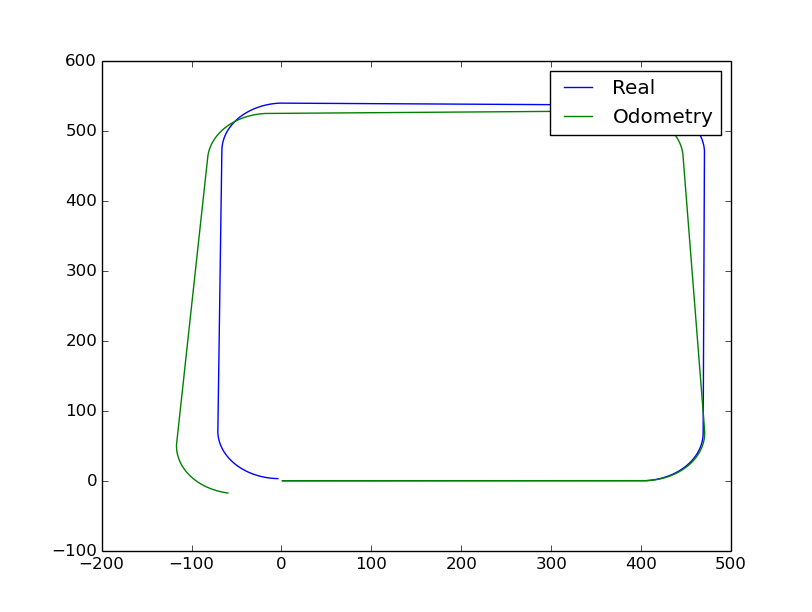
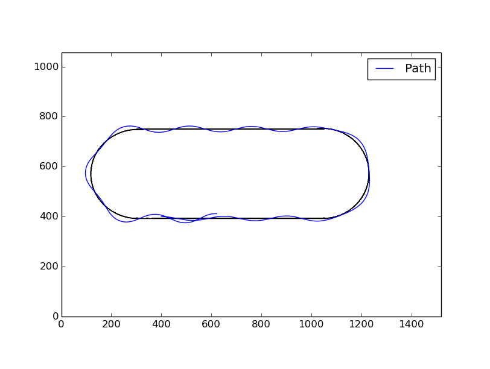

Tutorials
===========
This page shows how to implements the code in various ways.

Random Path Simulator
---------------------
This example show how to use the basic class **Bicycle**.

Its initialize a model with one meter between the wheels and max steer angle of
50º. The **sim_RandomPath** method simulate the model running at a constant
speed and a random steer angle for a number of steps, in the example 1m per step
for 1000 steps. ::

  import bicycle                          #import the model
  import matplotlib.pyplot as plt         #import matplotlib

  robot = bicycle.Bicycle(1,50)           #create a robot
  robot.sim_RandomPath(1,1000)            #run in a random path

  robot.show()                            #show the paths
  plt.show()                              #hold the plot

This code will result in a random trajectory of the model plot as a map-like
image, its a simple way to get lots of studies cases. The image below show a
example of plot from the code, you should get a different result as the code
uses a random function.

 Random path

Odometry Simulator
------------------
The **vehicle class** inherits the features of the bicycle and add some sensors,
making possible keep a history of the speeds and the steer angles of the model
all through its path.

Real encoders is not perfect(it really away from it in fact), so the simulator
add a Gaussian noise to its reads, making it more close to the real world robots
, you should set the standard deviation of the noise. The steer angle is assume
as a truth information, so no noise is add to it.

This example create a rectangular path and run it on a **vehicle** with a noisy
encoder, then show the path using directly the sensors data, with no filter, as
expected this result in a different path by the propagation of the error in the
measurements. ::

  import vehicle                          #import the vehicle model
  import matplotlib.pyplot as plt         #import matplotlib

  car = vehicle.Vehicle(1,50)             #create a robot
  car.setOdometry(True)                   #set the odometer on
  car.setOdometryVariance(0.4)            #configure its deviantion to 0.4
  speed,angle = [],[]                     #initialize the lists

  for a in xrange(4):                     #create a retangular path
      for i in xrange(400):
        angle.append(0)
      for i in xrange(107):
        angle.append(40)
  for i in xrange(len(angle)):            #set the speed to a constant along the path
    speed.append(1)

  car.sim_Path(speed,angle)               #run in a rectangular path
  speed , angle =  car.readOdometry()     #reads the sensors
  car2 = vehicle.Vehicle()                #create a second model
  car2.sim_Path(speed,angle)              #run it in the path read by odometry

  #show the paths
  robot.show("Real")
  car2.show("Odometry")
  plt.show()

 Real path and odometry based path

PID Control Simulator
---------------------
This example implement all the simulator's features, its use the **robot class**
its load a image file thats represents the "road map" image and run over it
autonomously following the black line.
The **camera class** is responsible to sense the environment taking
a "slice" of the image and finding the center of the black line on it, if no black
line was found at all it return the last error.

The PID controller is a proportional–integral–derivative controller
is a control loop feedback mechanism (controller) commonly used in industrial
control systems. A PID controller continuously calculates an error value as the
difference between a desired setpoint and a measured process variable. The
controller attempts to minimize the error over time by adjustment of a control
variable, such as the position of a control valve, a damper, or the power
supplied to a heating element, to a new value determined by a weighted sum.

A PID controller keep the robot on the path, it apply a steer angle to the model based
on the error value get from the camera. The error and the PID result is in a range
from -1 to 1 and it is scale to the maximum steer angle.

The robot class need a relation of pixels per meter to scale the map image, in
this case its used the default value(375 pxl/meter). The speed of the robot is
5mm or 1.875 pixels per step. ::

  import robot                          #import the model
  import matplotlib.pyplot as plt

  robot = robot.Robot("Maps/mapao.png") #inicialize the robot in the map
  robot.setPose(400,400,0)              #set a initial pose
  robot.sim_LineFollower(Steps = 1600,Kp=1,Ki = 0,Kd=0.3,v=0.005,debug=True)

  rob.show()  #plot the results
  plt.show()  #hold the plot

In this case the **debug** parameter is True, so the program will print all the
errors and the commands from the PID controller. You should get better results,
with the robot keeping more closer to the black line, with others gains
values in the controller.

  Line-Follower robot
